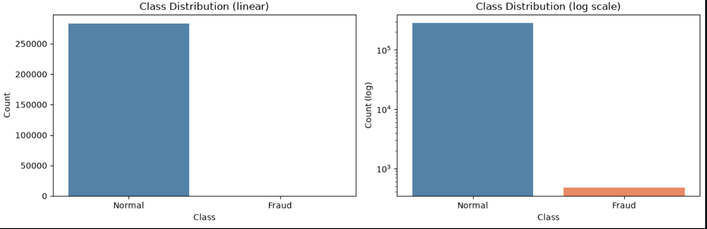
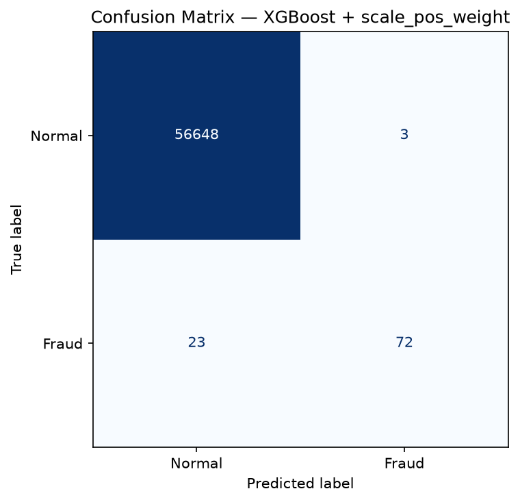
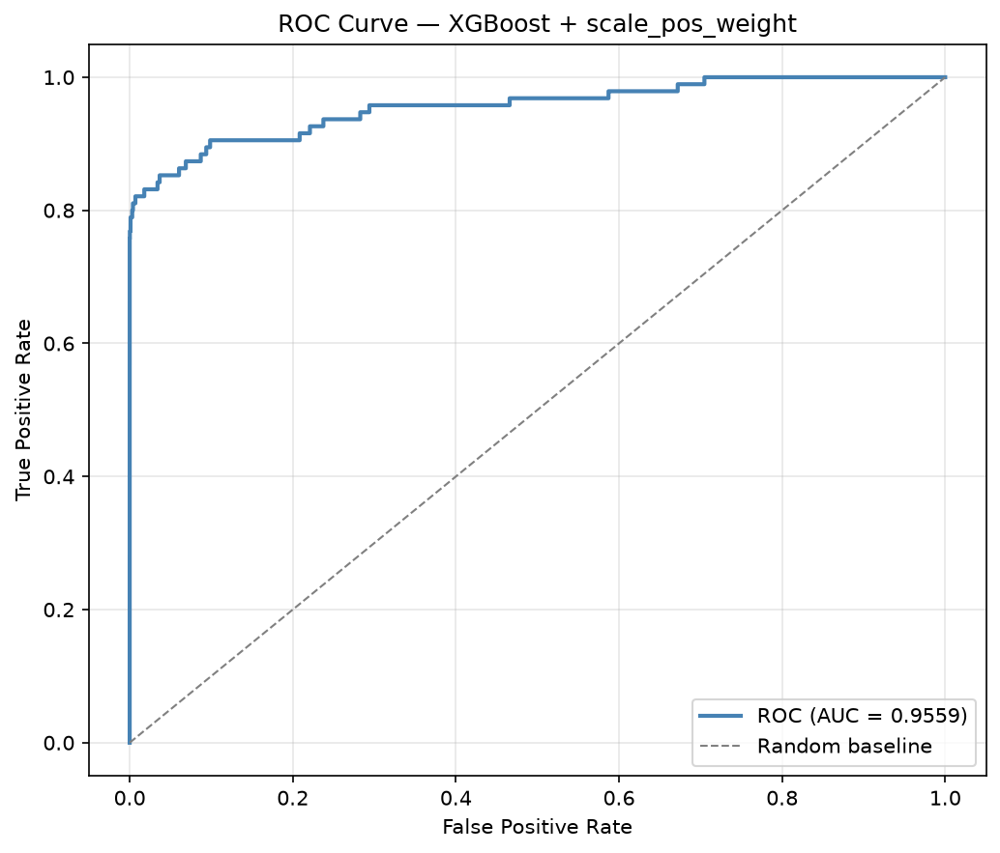
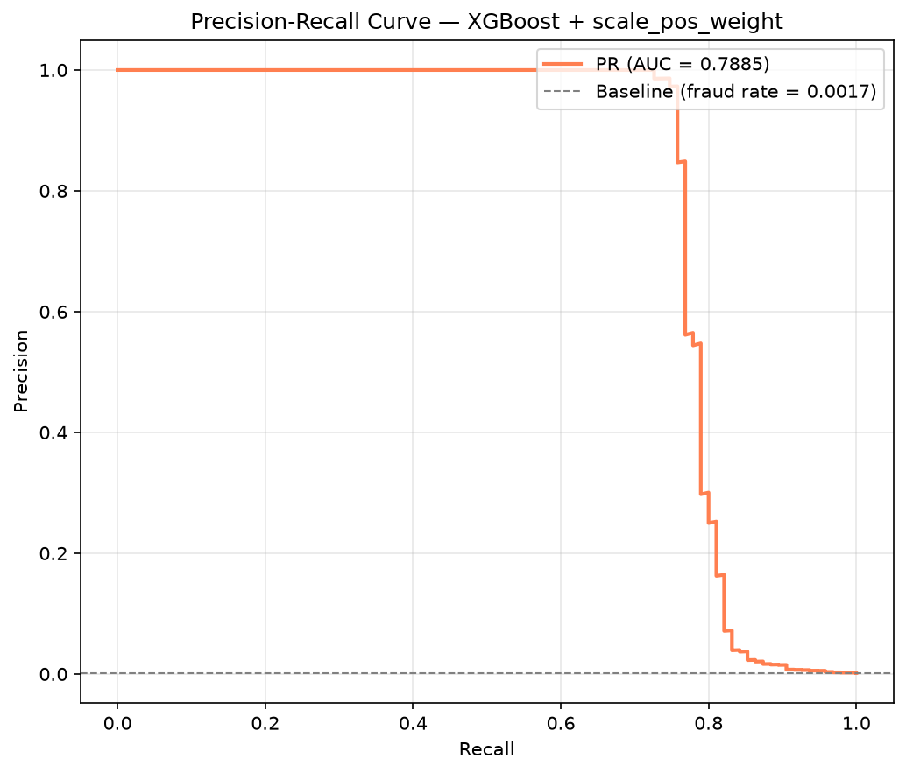
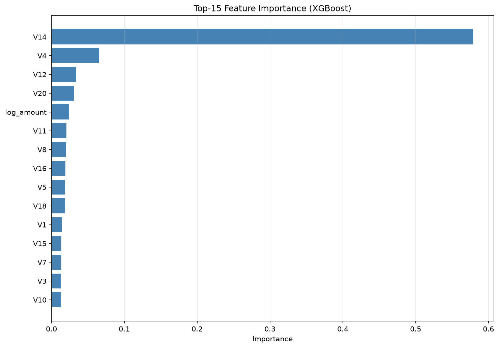
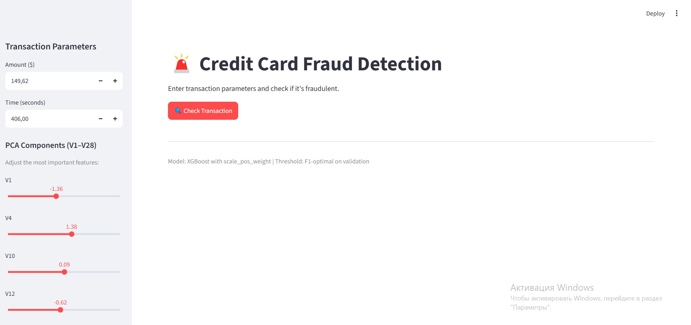
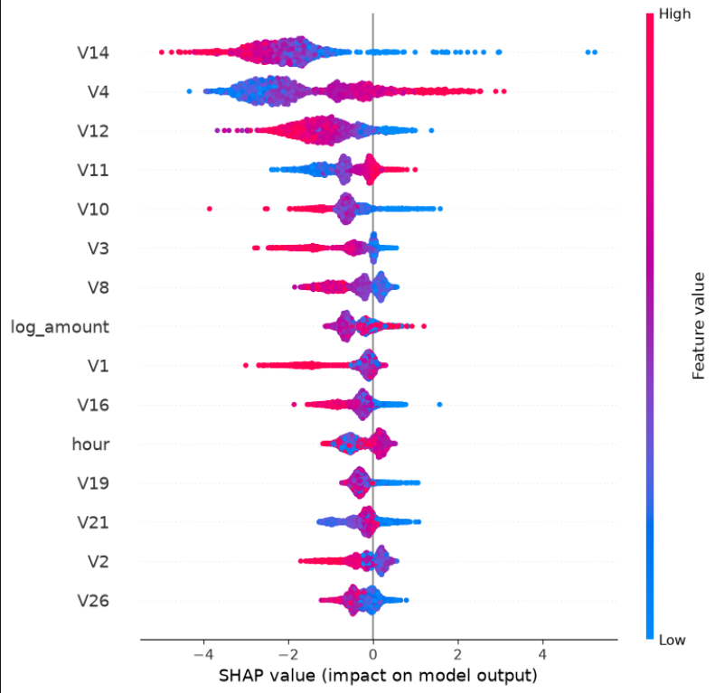

# Credit Card Fraud Detection

End-to-end machine learning project to detect fraudulent credit card transactions.

**Stack:** Python, XGBoost, FastAPI, Streamlit, Docker

---

## Quickstart

### Docker (Recommended)
```bash
docker build -t credit-card-fraud-api .
docker run -d -p 8000:8000 credit-card-fraud-api
```
Open [http://127.0.0.1:8000/docs](http://127.0.0.1:8000/docs)

### Streamlit Dashboard (Local)
```bash
pip install -r requirements.txt
streamlit run streamlit_app.py
```
Open [http://localhost:8501](http://localhost:8501)

### API Request Example
```bash
curl -X POST [http://127.0.0.1:8000/predict](http://127.0.0.1:8000/predict) \
  -H "Content-Type: application/json" \
  -d '{
    "Time": 406.0, "V1": -1.36, "V2": -0.07, "V3": 2.54, "V4": 1.38,
    "V5": -0.34, "V6": 0.46, "V7": 0.24, "V8": 0.10, "V9": 0.36,
    "V10": 0.09, "V11": -0.55, "V12": -0.62, "V13": -0.99, "V14": -0.31,
    "V15": 1.47, "V16": -0.47, "V17": 0.21, "V18": 0.03, "V19": 0.40,
    "V20": 0.25, "V21": -0.02, "V22": 0.28, "V23": -0.11, "V24": 0.07,
    "V25": 0.13, "V26": -0.19, "V27": 0.13, "V28": -0.02, "Amount": 149.62
  }'
```

**Response:**
```json
{
  "fraud_probability": 0.0,
  "threshold": 0.8280088901519775,
  "prediction": "NORMAL"
}
```

> **Note:** Model `.pkl` artifacts are committed for demo simplicity. In production, use S3 / MLflow / GitHub Releases for model storage.

---

## Problem Statement

Credit card fraud costs the global economy billions of dollars annually. Banks need to detect fraudulent transactions in real-time, but face two challenges:

1. **Extreme class imbalance** — only 0.17% of transactions are fraudulent
2. **Cost asymmetry** — missing a fraud costs far more than a false alarm

This project builds a production-ready ML service that classifies transactions as **fraudulent** or **normal** with high precision and recall.

**Business goal:** catch as many frauds as possible while keeping false alarms low.

---

## Dataset

**ULB Credit Card Fraud Detection** (Kaggle, `mlg-ulb/creditcardfraud`)

- **284,807** transactions, **31** features
- **492** fraudulent (0.17%), **284,315** normal
- Features **V1–V28** are PCA components (anonymized for privacy)
- Only **Time** and **Amount** are in original units

Source: [https://www.kaggle.com/datasets/mlg-ulb/creditcardfraud](https://www.kaggle.com/datasets/mlg-ulb/creditcardfraud)

---

## Key EDA Findings

- **Severe class imbalance** (0.17%) → accuracy is useless. Use Precision, Recall, F1, PR-AUC
- **Amount is right-skewed** → apply log1p transformation
- **Time shows daily periodicity** → extract `hour` as a feature
- **Top correlated features:** V17 (−0.33), V14 (−0.30), V12 (−0.26), V10 (−0.22)
- **Boxplots confirm** these features clearly separate fraud from normal

### Class Distribution



---

## Approach

1. **Data cleaning** — remove duplicates to avoid train/val leakage
2. **Feature engineering** — create `hour` (from Time) and `log_amount` (from Amount)
3. **Split** — 60/20/20 train/val/test with `stratify=y`
4. **Scaling** — StandardScaler on `log_amount` and `hour` (fit on train only)
5. **Models** — Logistic Regression, Random Forest, XGBoost
6. **Imbalance handling** — compared SMOTE vs `scale_pos_weight`
7. **Threshold tuning** — F1-optimal threshold via `precision_recall_curve`
8. **Explainability** — SHAP for feature importance
9. **Deployment** — FastAPI + Streamlit + Docker

---

## Results

### Model Comparison (Validation Set, F1-optimal threshold)

| Model | Precision | Recall | F1 |
|---|---|---|---|
| Logistic Regression | 0.844 | 0.768 | 0.804 |
| Random Forest | 0.879 | 0.808 | 0.842 |
| XGBoost + SMOTE | 0.963 | 0.798 | 0.873 |
| **XGBoost + scale_pos_weight** | **0.976** | **0.828** | **0.896** |

### Test Set — Final Model

**XGBoost with `scale_pos_weight`**

| Metric | Value |
|---|---|
| Precision | 0.960 |
| Recall | 0.758 |
| F1 | 0.847 |
| ROC-AUC | 0.956 |
| PR-AUC | 0.789 |

**Winner:** `scale_pos_weight` outperformed SMOTE on all metrics — it avoids synthetic examples and gives a cleaner model.

**Why PR-AUC matters:** F1 depends on a specific threshold. PR-AUC evaluates the model across all thresholds — this is the recommended metric for imbalanced fraud detection, where the operating threshold may shift.
### Confusion Matrix (Test Set)



### ROC Curve



### Precision-Recall Curve



### Feature Importance (XGBoost)



---

## Interactive Dashboard

An interactive web app built with Streamlit allows real-time predictions and manual testing of transaction features.



---

## SHAP — Model Explainability

Top-5 features by mean |SHAP value|:

**V14, V4, V12, V10, log_amount**

- **`log_amount` in top-5** → feature engineering validated
- **Fraud transactions tend to have lower V14, V12, V10** — confirms correlations
- **Different top features vs SMOTE model** — `scale_pos_weight` uses original data

### SHAP Feature Importance



---

## Project Structure

```text
credit-card-fraud/
├── api/
│   └── app.py                  # FastAPI application & REST endpoints
├── models/                     # Model artifacts
│   ├── feature_names.pkl       # Saved feature order
│   ├── fraud_model.pkl         # Trained XGBoost model
│   ├── scaler.pkl              # Trained StandardScaler
│   └── threshold.pkl           # F1-optimal threshold
├── notebooks/
│   └── 01_eda.ipynb            # Exploratory Data Analysis & experiments
├── src/
│   ├── predict.py              # Prediction & preprocessing logic
│   └── train.py                # Model training & threshold evaluation
├── .dockerignore               # Files excluded from Docker builds
├── Dockerfile                  # Dockerfile for FastAPI backend
├── requirements.txt            # Full local development environment
├── requirements-docker.txt     # Pinned minimal dependencies for Docker
├── streamlit_app.py            # Interactive Streamlit dashboard
└── README.md
```

---

## How to Run

### Option 1: Docker (recommended)
```bash
docker build -t credit-card-fraud-api .
docker run -d -p 8000:8000 credit-card-fraud-api
```
Open [http://127.0.0.1:8000/docs](http://127.0.0.1:8000/docs)

### Option 2: Streamlit Dashboard
```bash
pip install -r requirements.txt
streamlit run streamlit_app.py
```
Open [http://localhost:8501](http://localhost:8501)

### Option 3: Train Model Locally
```bash
pip install -r requirements.txt
python src/train.py
```
Saves model artifacts to `models/`.

---

## Tech Stack

| Area | Tools |
|---|---|
| Data | pandas, numpy |
| Modeling | scikit-learn, XGBoost, imbalanced-learn |
| Explainability | SHAP |
| API | FastAPI, Pydantic, uvicorn |
| Dashboard | Streamlit |
| Deployment | Docker |


